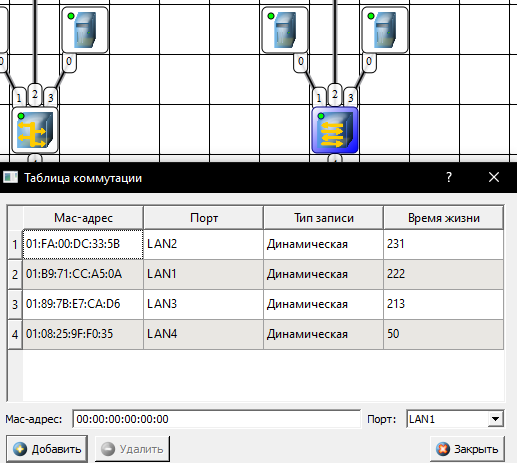
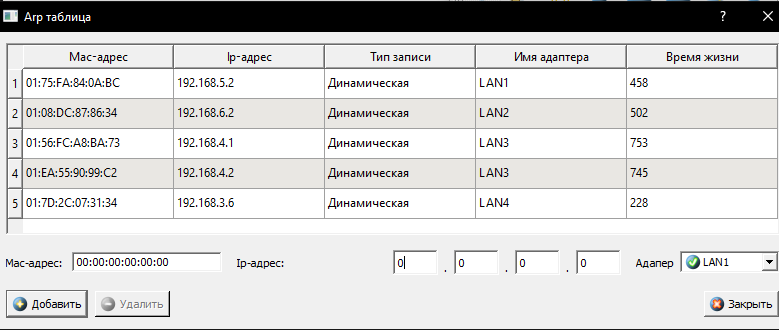

```markdown
# Лабораторная работа № 2 «Изучение программных средств тестирования и определения параметров настройки в компьютерных сетях»

#  Цель работы
Приобретение знаний и практических навыков в использовании программного обеспечения для настройки и тестирования компьютерной сети.

#  Материалы, оборудование и ПО
* Персональные компьютеры, объединенные в локальную сеть с доступом в Интернет.
* Встроенные сетевые утилиты ОС Windows (`ipconfig`, `hostname`, `ping`, `tracert`, `arp`).
* Специализированное ПО для анализа беспроводных сетей: `Wireless Network Watcher`, `WifiInfoView`.
* Веб-сервис тестирования сетевых параметров `2ip.ru`.

---

#  Ответы на контрольные вопросы для самопроверки

# 1. Какой формат имени сетевого ресурса может использоваться при обращении к нему?
При обращении к сетевому ресурсу могут использоваться три основных формата:
* **IP-адрес (числовой формат):** Уникальный числовой идентификатор устройства. Бывает в формате IPv4 (например, `192.168.1.1`) или IPv6 (например, `2001:db8::1`).
* **Доменное имя (DNS-имя):** Символьное имя, удобное для восприятия человеком (например, `yandex.ru`, `klgtu.ru`). Автоматически преобразуется в IP-адрес с помощью службы DNS.
* **UNC-путь (Universal Naming Convention):** Используется для обращения к общим ресурсам (папкам, принтерам) в локальных сетях Windows. Формат: `\\Имя_Компьютера\Имя_Общего_Ресурса` (например, `\\Server-Main\SharedDocs`).

# 2. Какой протокол необходим для работы с утилитой ping? Найти описание и характеристики протокола.
Для работы утилиты `ping` необходим протокол **ICMP (Internet Control Message Protocol)** — протокол межсетевых управляющих сообщений.
* **Описание:** ICMP входит в стек протоколов TCP/IP и работает на **сетевом уровне** (Network Layer) модели OSI непосредственно поверх IP. Он предназначен для передачи сообщений об ошибках, маршрутизации и выполнения сетевой диагностики. Не используется для обмена пользовательскими данными.
* **Характеристики:**
  * **Тип передачи:** Работает без установления соединения и не гарантирует надежность доставки.
  * **Типы сообщений утилиты ping:** Изучаемая утилита использует сообщения двух типов: `Echo Request` (Тип 8, эхо-запрос) и `Echo Reply` (Тип 0, эхо-ответ).
  * **Размер пакета:** По умолчанию в ОС Windows отправляется тело запроса размером **32 байта** (вместе с заголовками IP и ICMP размер пакета на канальном уровне составляет 60 байт).

# 3. Зачем используется параметр `/all` в утилите ipconfig?
По умолчанию команда `ipconfig` выводит только краткие базовые настройки (IP-адрес, маску подсети и основной шлюз) для активных сетевых адаптеров. Ключ `/all` переводит утилиту в режим **подробного отображения информации**. Дополнительно выводятся:
* Физический адрес сетевой карты (**MAC-адрес**).
* Статус работы протокола **DHCP** (автоматическое распределение IP) и автонастройки.
* Адреса **DNS-серверов** и DHCP-сервера.
* Сведения о времени получения и окончания срока аренды IP-адреса.
* Имя хоста и DNS-суффикс подключения.

# 4. Каким образом утилиты ping и tracert осуществляют прослеживание маршрутов пакетов к заданному узлу?
* **Утилита `ping` маршрут не прослеживает**. Она отправляет прямой пакет `Echo Request` на конечный IP/домен. Все промежуточные маршрутизаторы просто пересылают его дальше. `ping` фиксирует только доступность конечной точки и время двусторонней задержки (RTT).
* **Утилита `tracert` осуществляет трассировку** маршрута за счет манипуляций с полем **TTL (Time to Live)** в заголовке IP-пакета:
  1. Отправляется серия пакетов с **`TTL = 1`**. Первый же маршрутизатор уменьшает TTL на 1, получает значение 0, уничтожает пакет и возвращает отправителю сообщение `ICMP Time Exceeded` (время жизни пакета истекло). Так фиксируется первый хоп.
  2. Процесс циклически повторяется с увеличением TTL на единицу (`TTL = 2`, `TTL = 3` и т.д.). Каждый следующий маршрутизатор по цепочке отбрасывает пакет и сообщает свой адрес.
  3. Трассировка завершается при получении ответа от целевого узла (`Echo Reply`) либо при достижении максимального числа шагов.

# 5. Можно ли утилитой tracert задать максимальное число ретрансляций?
**Да, можно.** По умолчанию в Windows этот параметр равен 30 хопам. Изменить его можно с помощью ключа **`-h`** (maximum_hops).
> *Пример использования:* `tracert -h 15 yandex.ru` (ограничивает поиск маршрута максимум 15 промежуточными узлами).

# 6. Что такое localhost?
**localhost** — стандартное, зарезервированное доменное имя для так называемого «интерфейса петли» (loopback-интерфейса). Оно используется компьютером для обращения *к самому себе*.
* В протоколе IPv4 ему жестко соответствует IP-адрес **`127.0.0.1`**.
* В протоколе IPv6 ему соответствует адрес **`::1`**.
При отправке данных на `localhost` сетевые пакеты не уходят в физическую сеть (кабель или Wi-Fi), а обрабатываются внутри сетевого стека ОС. Это критически важно для изолированного тестирования клиент-серверного ПО на одной машине.


# Задание 1. Определение локального IP-адреса компьютера
В интерфейсе командной строки выполнены команды `ipconfig` и `ipconfig /all`.


# Задание 2. Определение имени узла компьютера
Выполнена команда hostname для получения сетевого имени локальной рабочей станции.

Тестирование локального сетевого интерфейса:

Проверка связи с узлом KLGTU.RU:

Проверка связи с узлом YANDEX.RU:

# Задание 4. Трассировка маршрута пакетов до заданного узла
Выполнена команда tracert для анализа цепочки маршрутизаторов на пути к удаленным серверам.

Трассировка маршрута до узла YANDEX.RU:


# Задание 5. Анализ соответствия IP и MAC-адресов в локальной сети (ARP-таблица)
С помощью команды arp -a выведен кэш адресного протокола.


# Задание 6. Мониторинг сети с помощью Wireless Network Watcher
Запущена утилита WNetWatcher.exe. По результатам пассивного и активного сканирования подсети были обнаружены подключенные хосты:

# Задание 7. Анализ радиоэфира Wi-Fi через WifiInfoView
С помощью WifiInfoView.exe проведен мониторинг доступных SSID диапазонов 2.4 ГГц и 5 ГГц.


# Задание 8. Тестирование внешних параметров через 2IP
При переходе на веб-сервис 2ip.ru получены глобальные параметры соединения:



